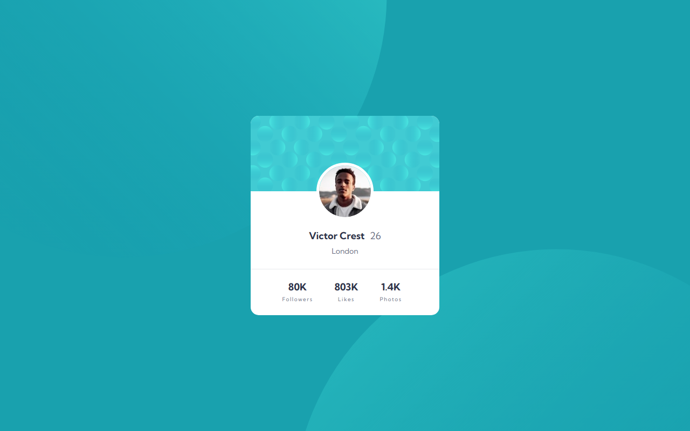

# Frontend Mentor - Profile card component solution

This is a solution to the [Profile card component challenge on Frontend Mentor](https://www.frontendmentor.io/challenges/profile-card-component-cfArpWshJ). Frontend Mentor challenges help you improve your coding skills by building realistic projects. 

## Table of contents

- [Overview](#overview)
  - [The challenge](#the-challenge)
  - [Screenshot](#screenshot)
  - [Links](#links)
- [My process](#my-process)
  - [Built with](#built-with)
  - [What I learned](#what-i-learned)
  - [Continued development](#continued-development)
  - [Useful resources](#useful-resources)
- [Author](#author)

## Overview

### The challenge

- Build out the project to the designs provided

### Screenshot

### Links

- Solution URL: [URL](https://www.frontendmentor.io/solutions/profile-card-component-using-react-cRLWDm-v3O)
- Live Site URL: [URL](https://profile-card-component-chi-three.vercel.app/)

## My process

### Built with

- SCSS
- Flexbox
- Mobile-first workflow
- [React](https://reactjs.org/) - JS library

### What I learned

I am practicing React.

### Continued development

React, React and React

### Useful resources

- [Name that Color](https://chir.ag/projects/name-that-color/) - I wanted to try a different way of naming SCSS variables. It is fun. 

## Author

- Frontend Mentor - [@miguelzaga](https://www.frontendmentor.io/profile/miguelzaga)

